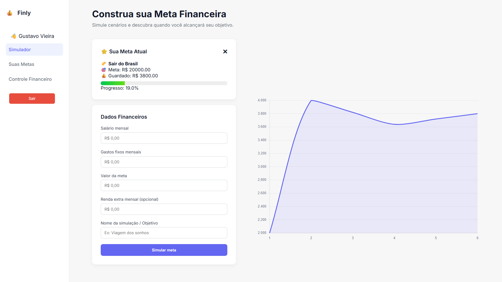
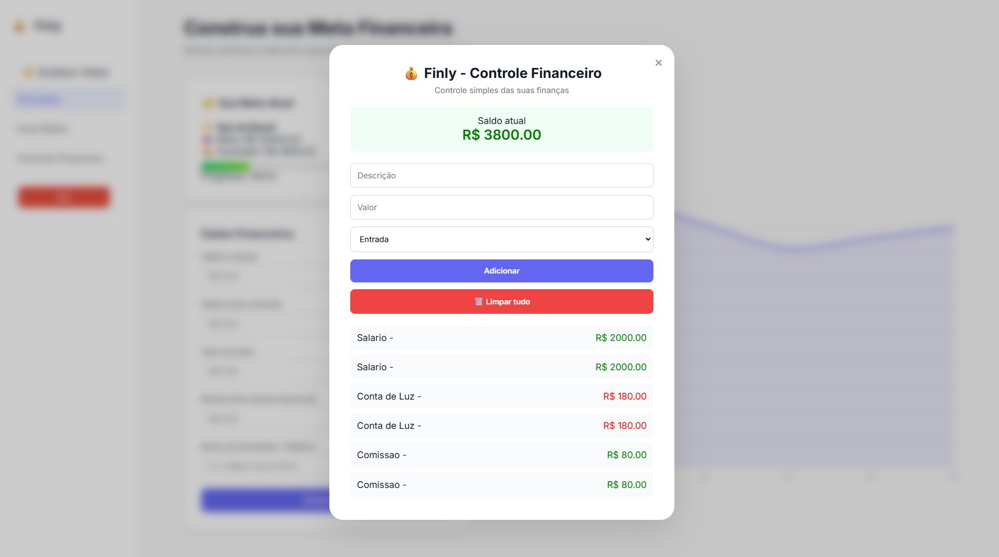

# Finly - Simulador Financeiro

💰 **Finly** é um sistema web para controlar finanças pessoais, simular metas financeiras e acompanhar seu progresso com gráficos interativos.

---

## 📌 Funcionalidades

- Criar conta e login seguro.
- Registrar metas financeiras e simulações personalizadas.
- Visualizar tempo estimado para alcançar cada meta.
- Marcar metas como favoritas para acompanhamento no dashboard.
- Histórico de todas as simulações.
- Controle financeiro com registro de entradas e saídas.
- Gráfico interativo de saldo ao longo do tempo.

---

## 🛠 Tecnologias

- **Frontend:** HTML, CSS, JavaScript  
- **Backend:** PHP  
- **Banco de Dados:** MySQL  
- **Servidor local:** XAMPP (Apache + MySQL)  
- **Gráficos:** Chart.js  

---

## 📂 Estrutura do Projeto
FINLY/
│
├── api/
│   ├── adicionar_transacao.php
│   ├── excluir_simulacao.php
│   ├── favoritar_meta.php
│   ├── limpar_transacoes.php
│   ├── listar_simulacoes.php
│   ├── listar_transacoes.php
│   ├── meta_favorita.php
│   ├── remover_favorita.php
│   └── salvar_simulacao.php
│
├── assets/
│   ├── img/
│   │   ├── controle_financeiro.png
│   │   └── dashboard.png
│   │
│   ├── login.css
│   ├── script.js
│   └── style.css
│
├── auth/
│   ├── login.php
│   └── registro.php
│
├── config/
│   └── conexao.php
│
├── dashboard/
│   └── index.php
│
├── database/
│
├── logout.php
├── README.md
└── teste.php

---

## 🚀 Como Rodar

1. Clone o repositório ou copie os arquivos para a pasta `htdocs` do XAMPP.  
2. Certifique-se de que o Apache e o MySQL estão rodando no XAMPP.  
3. Crie um banco de dados no phpMyAdmin, por exemplo `finly_db`.  
4. Importe as tabelas usando o arquivo SQL (você pode criar manualmente com base nos scripts PHP).  
5. Configure o arquivo `config/conexao.php` com suas credenciais do MySQL.  
6. Acesse `http://localhost/finly/dashboard/index.php` no navegador.  

---

## 🖼 Capturas de Tela

**Dashboard Principal**

**Modal Controle financeiro**

---

## 🔑 Login de Teste

- **Email:** admin@teste
- **Senha:** 1234

*(ou crie uma conta nova pelo formulário de registro)*

---

## 💡 Observações

- O sistema funciona melhor em **Google Chrome** ou **Microsoft Edge**.  
- Todos os dados são salvos localmente no **MySQL** via **XAMPP**.  
- As metas favoritas aparecem no **dashboard** para acompanhamento rápido.  
- As transações e simulações são vinculadas ao usuário logado.  
- O gráfico do dashboard atualiza automaticamente ao adicionar ou remover transações.  
- O projeto é totalmente local e **não exige servidor externo**, ideal para testes e aprendizado.

---

## 📝 Licença

Este projeto é **open-source** e pode ser usado livremente para **aprendizado** ou **projetos pessoais**.

---

Feito por **Gustavo Vieira**.